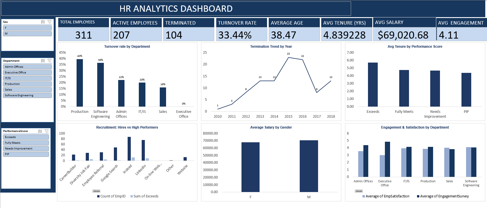

# HR Analytics: Employee Workforce Analysis

Analysis of 311 employees (2006 to 2019) covering turnover, recruitment, pay, engagement, and tenure. The project cleans a messy HR dataset, builds an interactive Excel dashboard, and answers eight business questions with a clear recommendation for each.

**Headline result:** turnover is **33.4%**, and it is not spread evenly. It concentrates in the **Production** department, in employees **under 30**, and in the years **2015 and 2016**.

 

---

## The Dataset

The dataset contains **311 employees** and **39 columns** of HR records:

- **Employee details:** names, IDs, dates of birth, hire and termination dates, department, manager, position
- **Pay and performance:** salary, performance score, engagement survey, satisfaction score, absences
- **Sourcing and demographics:** recruitment source, marital status, and related fields

No hires, terminations, or performance reviews exist after 2019.

## Data Cleaning

The raw file had quality issues, all fixed before analysis:

- Recalculated **Age** and **Tenure** to a fixed 31 December 2019 cutoff instead of today's date
- Filled **8 blank Manager IDs** using a name lookup
- Standardized text with TRIM and PROPER on five columns, keeping acronyms like IT and DBA intact
- Reconciled **EmploymentStatus** with the Termd flag and cleared TermReason for active staff
- Engineered **Term_Year**, **Age_Group**, and **Exceeds**, then froze all formulas to static values

## Key Performance Indicators

| KPI | Value |
|---|---|
| Total Employees | 311 |
| Active | 207 |
| Terminated | 104 |
| Turnover Rate | 33.4% |
| Average Age | 38.5 yrs |
| Average Tenure | 4.84 yrs |
| Average Salary | $69,021 |
| Average Engagement | 4.11 |

## Business Questions and Answers

| # | Question | Answer |
|---|---|---|
| 1 | Turnover rate and by department | 33.4% overall; Production highest (39.7%), Sales lowest (16.1%) |
| 2 | Worst year for terminations | 2015, with 23 exits |
| 3 | Tenure of leavers, Production vs IT | ~3 yrs; IT/IS leaves faster (1.3 yrs) than Production (3.3 yrs) |
| 4 | Best recruitment source | Indeed for volume (87 hires); Diversity Job Fair for quality |
| 5 | Gender pay gap | Men $70,629 vs women $67,787, a 4.2% gap |
| 6 | Highest-turnover age group | Under 30, at 77.5% |
| 7 | Engagement and satisfaction | Admin highest engagement (4.39); Software Eng highest satisfaction (4.09) |
| 8 | Do high performers stay longer | Yes: Exceeds stay 5.7 yrs vs 4.4 yrs on a PIP |

## Recommendations

1. **Fix Production first.** Highest turnover in the largest team, so it moves the company number most.
2. **Keep under-30s** with structured onboarding, mentoring, and early check-ins.
3. **Repair IT/IS early exits** by improving the first-year experience.
4. **Recruit for quality** by growing referrals and the Diversity Job Fair.
5. **Verify the pay gap** with a like-for-like review before acting.

## Repository Structure

```
hr-analytics/
├── README.md
├── Data/
│   ├── HR_DATASET_raw.xlsx          # original dataset
│   └── HR_Cleaned_Dataset.xlsx      # cleaned, static values
├── Dashboard/
│   └── HR_Analytics_Dashboard.xlsx  # interactive dashboard (PivotTables, charts, slicers)
├── Report/
│   └── HR_Analytics_Report.docx     # full written report
├── Presentation/
│   └── HR_Analytics_Presentation.pptx
└── Image/
    └── dashboard.png
```

## Tools

Microsoft Excel (Power Query, PivotTables, PivotCharts, slicers) for cleaning, the dashboard, and analysis. Word and PowerPoint for the report and presentation.

## Author

Prepared by **Idowu Blessing Apara**.
